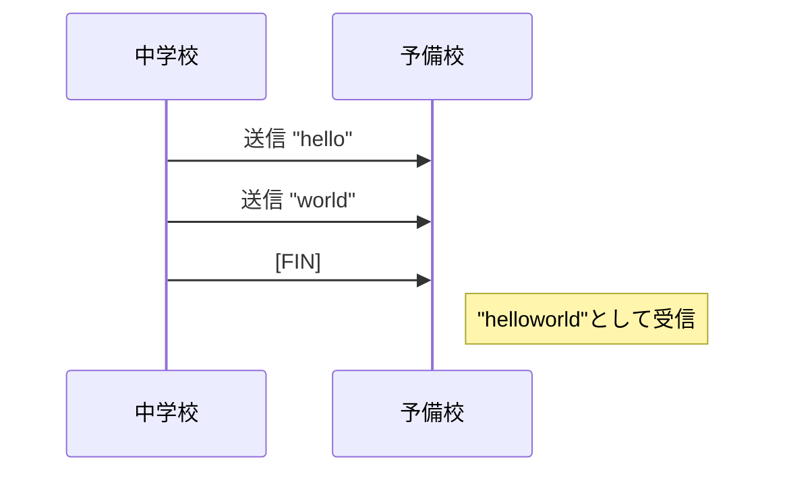
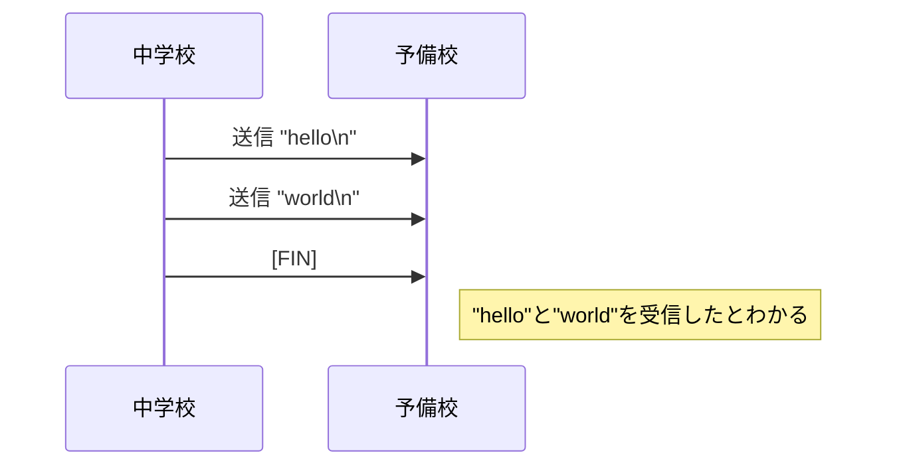

[README.md](../README.md) > APPENDIX

文責: 2023年度TA 修士2年 奥山

# APPENDIX(読む必要はありません。): TCP通信の仕様について

本節では本テンプレートが今後受け継がれていくことを見越し、本演習のために用意したTCP通信の細かい仕様を残します。

演習のために知る必要は全くありません。

## モジュールについて

TCP通信を行うモジュールは https://github.com/uecconsecexp/secexp2022 にあります。テンプレートではこのサイトからコードを取得しています。

本ドキュメントに書かれていない詳細はこのリポジトリにあるコードを読んで得てください。

## TCP通信について

予備校側のホストがポート10000番を開け、そこにクライアントとして中学校側が接続します。通信環境によってはファイアウォール設定を変える必要があるでしょう。

(なぜポート10000を使用しているのかは、元となるJavaコードを引き継いだTAである筆者は存じ上げません。Wellknownポートでなければなんでも良さそうです。)

TCPソケット通信はEOFが来て通信を閉じるまでバイト同士を**単純に**送受信し合うようにできています。

何を意味するかというと、デフォルトではどこまでが1回の送信・受信であるかに決まりはなく、片側から複数連続で送信を行うと、どの送信がどのデータを含むのかわからなくなってしまいます。



そのため送信されてきたデータにはデリミタとして改行を入れることにしました。(改行である必要はありませんでしたが、一般的なデリミタということで採用しています。)



送信データ自体が含む改行は、`\n`は`\\n`に、`\r\n`は`\\r\\n`にそれぞれエスケープしています。

1回の通信の流れ

- [送信側] 送信データの改行をエスケープする。
- [送信側] 送信データの最後に改行を入れる。
- [送信側] 送信する。
- [受信側] 受信する。
- [受信側] 改行までを取り出す。
- [受信側] 受信したデータのエスケープを元に戻す。

## 行列の送受信について

行列を直接バイト列にして変換すると環境間での互換性が失われてしまうことを考慮し、行列は次のJSONフォーマットを施した文字列の形で送受信する仕様になっています。

以下は2×2の場合の例です(読みやすく改行を入れています)。サイズは任意です。

```json
{
    "data": [
        ["1E+00","2E+00"],
        ["3.141592653589793E+00","3.010299956639812E-01"]
    ]
}
```

文字列の二次元配列である`data`フィールドを持つJSONオブジェクトでやり取りします。

浮動小数点( `float64` )を文字列にするのは、各環境での橋渡しをしやすいようにするためです。

なお、Go言語において浮動小数点を文字列に変える操作は`strconv.FormatFloat(数値, 'E', -1, 64)`で行っており、指数表現になっています。